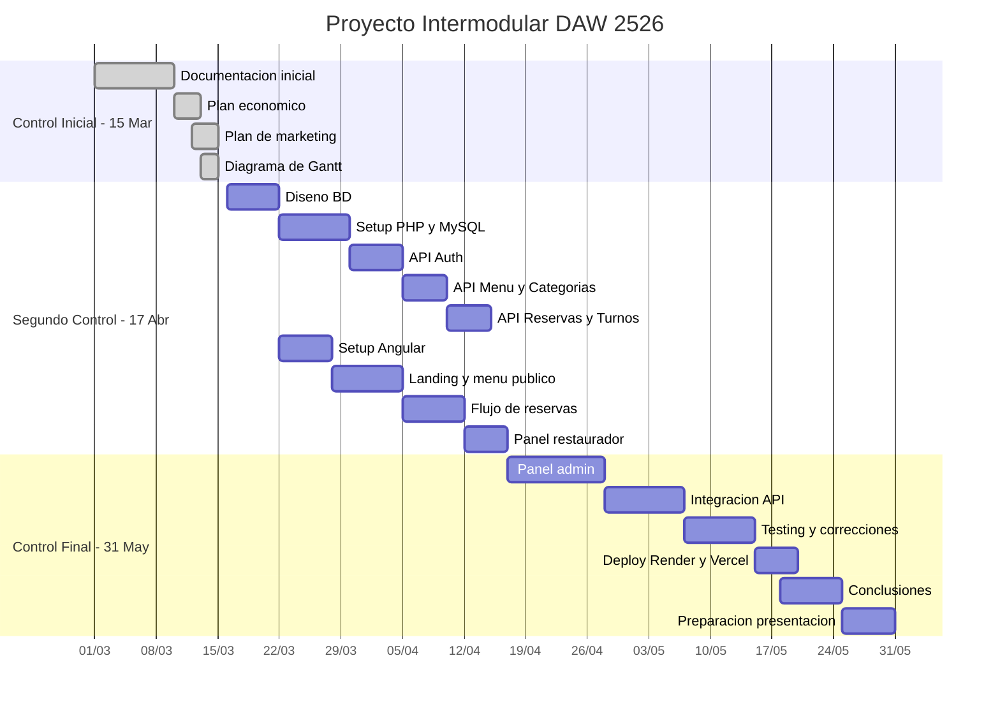

```mermaid
gantt
    dateFormat  YYYY-MM-DD
    axisFormat  %d/%m
    title       Proyecto Intermodular DAW 2526
    todayMarker off

    section Control Inicial - 15 Mar
    Documentacion inicial      :done, 2026-03-01, 2026-03-10
    Plan economico             :done, 2026-03-10, 2026-03-13
    Plan de marketing          :done, 2026-03-12, 2026-03-15
    Diagrama de Gantt          :done, 2026-03-13, 2026-03-15

    section Segundo Control - 17 Abr
    Diseno BD                  :2026-03-16, 2026-03-22
    Setup PHP y MySQL          :2026-03-22, 2026-03-30
    API Auth                   :2026-03-30, 2026-04-05
    API Menu y Categorias      :2026-04-05, 2026-04-10
    API Reservas y Turnos      :2026-04-10, 2026-04-15
    Setup Angular              :2026-03-22, 2026-03-28
    Landing y menu publico     :2026-03-28, 2026-04-05
    Flujo de reservas          :2026-04-05, 2026-04-12
    Panel restaurador          :2026-04-12, 2026-04-17

    section Control Final - 31 May
    Panel admin                :2026-04-17, 2026-04-28
    Integracion API            :2026-04-28, 2026-05-07
    Testing y correcciones     :2026-05-07, 2026-05-15
    Deploy Render y Vercel     :2026-05-15, 2026-05-20
    Conclusiones               :2026-05-18, 2026-05-25
    Preparacion presentacion   :2026-05-25, 2026-05-31
```
